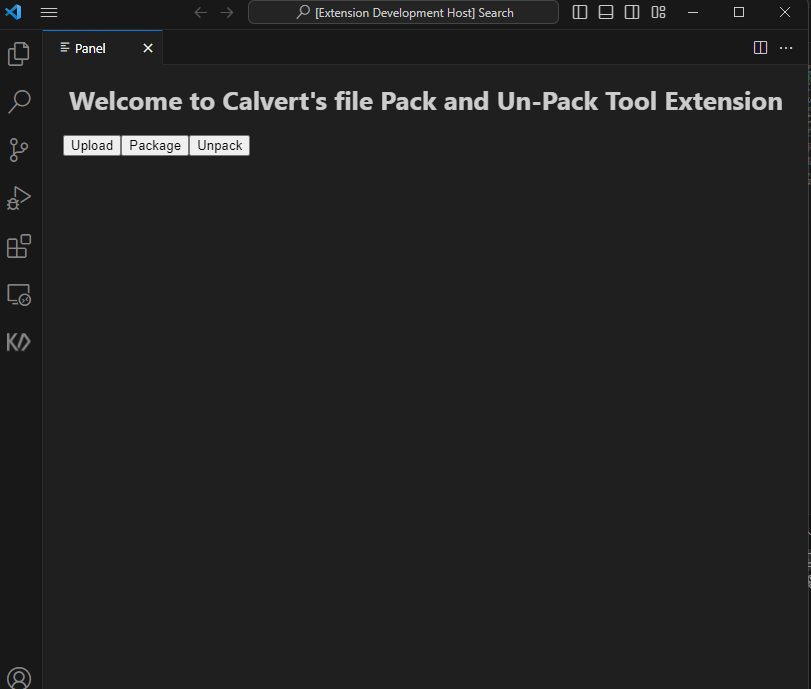

# testing-pp README
# VSCodePackageManager

VSCodePackageManager is a Visual Studio Code extension that allows you to easily manage file packaging and unpacking within the editor.

## Features

- Describe the core features of your extension.
- Outline any unique selling points or functionality.

## Installation

To install VSCodePackageManager:

1. Open Visual Studio Code.
2. Go to the Extensions view by clicking on the Extensions icon in the Activity Bar on the side of the window.
3. Search for "VSCodePackageManager".
4. Click on the Install button.

Alternatively, you can install it via the Command Palette:

1. Open the Command Palette (`Ctrl+Shift+P` or `Cmd+Shift+P` on Mac).
2. Type `ext install` followed by the extension's name, like `ext install vscodepackagemanager`.

## Compilation

To compile the extension from the source:

1. Clone the repository:

   ```bash
   git clone https://github.com/Vert86/VSCodePackageManager.git

Navigate to the cloned directory:

cd VSCodePackageManager
Install dependencies:

npm install
Compile the TypeScript files (if applicable):

npm run compile

Activation
To activate the extension:

Open a project in Visual Studio Code.
Open the Command Palette (Ctrl+Shift+P or Cmd+Shift+P on Mac).
Type testing-pp.showPanel and hit Enter.
This will open the webview panel where you can use the features of the VSCodePackageManager.

Screenshot
VSCodePackageManager Extension Panel
## Screenshot


